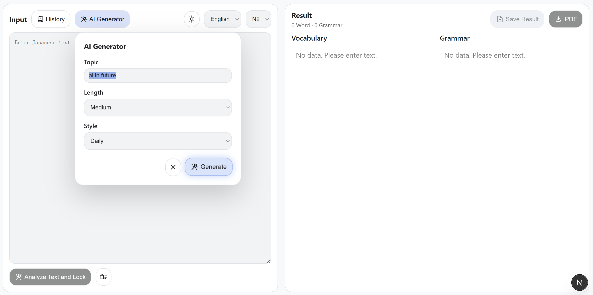

# JP Reading Assistant

AI-powered Japanese reading assistant for turning real text into structured study material.

[English](README.md) | [简体中文](README.zh.md)

JP Reading Assistant is a full-stack web application built around a practical reading workflow: bring in or generate apanese text, analyze it into vocabulary and grammar, inspect difficult parts in context, refine the result list, and save the session for later review.

## Why This Project Stands Out

- Structured output pipeline for vocabulary, grammar, translation, and title generation
- Clear service boundaries between text analysis, explanation, translation, text generation, PDF export, and persistence
- Real product UX considerations: editable results, history reload, language switching, dark mode, and loading/error states
- Multi-provider LLM integration behind one backend abstraction layer

## Demo

- [Demo Video Link Here](https://your-demo-link-here)

<p align="center">
  
  <br/>
  <em>Main Interface and AI Text Generator</em>
</p>
<p align="center">
  
  <br/>
  <em>Analysis Results</em>
</p>
<p align="center">
  
  <br/>
  <em>Context Explain Modal</em>
</p>
<p align="center">
  
  <br/>
  <em>History</em>
</p>

## Core Features

- Paste Japanese text and analyze it into vocabulary and grammar lists aligned with a selected JLPT level
- Generate Japanese reading passages by topic, level, length, and style
- Explain selected text in context
- Use separate explain modes for short selections and sentence-length selections
- Edit the result set by adding explained items or removing analysis items
- Save analyzed sessions into a local SQLite database
- Reload, browse, refresh, and delete saved results from the history panel
- Export the current result list as PDF
- Switch explanation/output language between English and Chinese
- Toggle between light and dark mode

## How It Works

1. Input Japanese text manually or generate a passage with AI.
2. Lock the text and send it to the analysis pipeline.
3. The backend returns structured vocabulary and grammar items.
4. Select a word or sentence to request a contextual explanation.
5. For sentence explanations, the app runs translation and analysis as separate steps.
6. Edit the final study list in the UI.
7. Save the session to SQLite or export it as PDF.

## Tech Stack

- Frontend: Next.js 16, React 19, TypeScript
- Backend: Python FastAPI, Pydantic v2, SQLModel, Uvicorn
- Database: SQLite
- LLM integration: Ollama, OpenAI, Gemini, DeepSeek, Mock provider
- Reliability: Tenacity-based retry handling for LLM calls
- PDF export: ReportLab with Noto Sans JP / SC fonts

## Technical Highlights

### Structured LLM Output

- Backend services request JSON-shaped outputs and validate them with Pydantic models
- LLM responses go through centralized extraction, validation, and retry handling in `backend/app/services/llm.py`
- Provider switching is handled through a strategy map instead of feature-specific branching throughout the codebase

### Modular Frontend and Backend Design

- Frontend page orchestration stays in `frontend/app/page.tsx`
- Async product flows are split into feature hooks such as `useAnalyzeFeature`, `useExplainFeature`, `useGenerateTextFeature`, `useExportPdf`, and `useSavedResultsFeature`
- Backend responsibilities are split across API routes, services, repositories, models, and schemas

### Explain Flow vs. Analysis Flow

- `POST /api/analyze` focuses on extracting learnable vocabulary and grammar from a passage
- `POST /api/explain` supports two different paths:
- Word mode returns a focused explanation for the selected text
- Sentence mode composes translation and full analysis for the selected sentence
- This separation keeps the UX clearer and avoids overloading one endpoint with mixed responsibilities

### Persistence, History, and Export

- Saved reading sessions are stored in SQLite using `Result`, `Vocab`, and `Grammar` tables
- The history panel supports list, detail reload, refresh, and delete flows
- Save titles are generated on the backend, with a fallback preview title if title generation fails
- Current results can be exported to PDF for offline review

## Project Structure

```text
jp-reading-assistant/
├─ backend/
│  ├─ app/
│  │  ├─ api/            # FastAPI routes
│  │  ├─ db/             # DB setup and session management
│  │  ├─ models/         # SQLModel tables
│  │  ├─ repositories/   # Data access layer
│  │  ├─ services/       # LLM, analysis, explanation, PDF, persistence
│  │  ├─ schemas.py      # Request / response contracts
│  │  └─ main.py         # FastAPI entry point
│  └─ tests/
├─ frontend/
│  ├─ app/               # Next.js App Router
│  ├─ components/        # UI panels and modals
│  ├─ hooks/             # Feature hooks
│  └─ lib/               # API client, i18n, helpers, types
└─ docs/
   ├─ architecture.md
   └─ decision_log.md
```

## API Surface

- `POST /api/analyze`
- `POST /api/explain`
- `POST /api/generate-text`
- `POST /api/export_pdf`
- `POST /api/results`
- `GET /api/results`
- `GET /api/results/{result_id}`
- `DELETE /api/results/{result_id}`
- `GET /health`

## Local Setup

### Backend

```bash
cd backend
python -m venv .venv
```

Windows:

```bash
.\.venv\Scripts\Activate.ps1
```

macOS / Linux:

```bash
source .venv/bin/activate
```

Install dependencies:

```bash
pip install -r ../requirements.txt
```

Create `backend/.env` from `backend/.env.example`, then start the server:

```bash
uvicorn app.main:app --reload
```

### Frontend

Create `frontend/.env` or `frontend/.env.local`:

```env
NEXT_PUBLIC_BACKEND_URL=http://127.0.0.1:8000
```

Then run:

```bash
cd frontend
npm install
npm run dev
```

### Windows Quick Start

The repository includes a helper script that can bootstrap local development:

```powershell
.\start-dev.ps1
```

First-time dependency install:

```powershell
.\start-dev.ps1 -Install
```

## Environment Notes

Current backend configuration supports separate providers for:

- analyzer
- explainer
- translator
- text generator

The codebase currently includes provider support for:

- `ollama`
- `openai`
- `gemini`
- `deepseek`
- `mock`

## Realistic Next Improvements

- Improve provider configuration ergonomics and document all supported environment variables more fully
- Add richer history capabilities such as search, filter, or tagging for saved study sessions

## Engineering Challenges and Lessons

- LLM integration became more reliable after moving JSON extraction, schema validation, and retry logic into one shared backend layer instead of repeating it in each service
- Separating page orchestration from feature hooks reduced coupling in the frontend and made the product workflow easier to extend
- Treating sentence explanation as translation plus analysis produced a cleaner UX and clearer backend responsibilities than forcing one large prompt to do everything
- One practical engineering challenge was deciding which work belonged to which endpoint and layer; clarifying boundaries between title generation, persistence, analysis, and explanation made the system easier to maintain and extend

## Additional Notes

- The project currently stores history locally in SQLite
- A lightweight health endpoint and environment-based CORS configuration are included for deployment
- Related implementation notes are available in [docs/architecture.md](docs/architecture.md) and [docs/decision_log.md](docs/decision_log.md)
