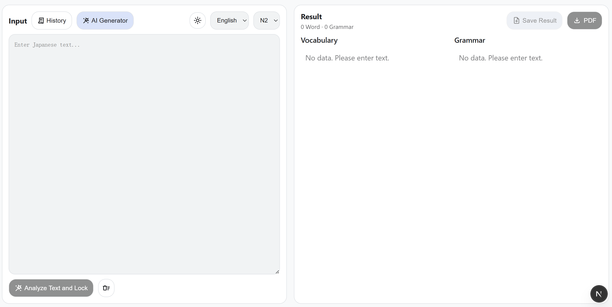
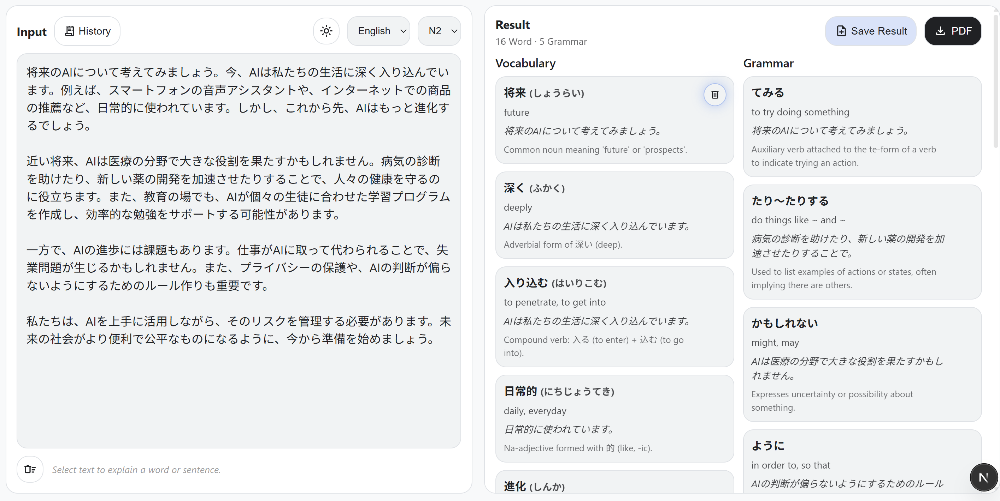
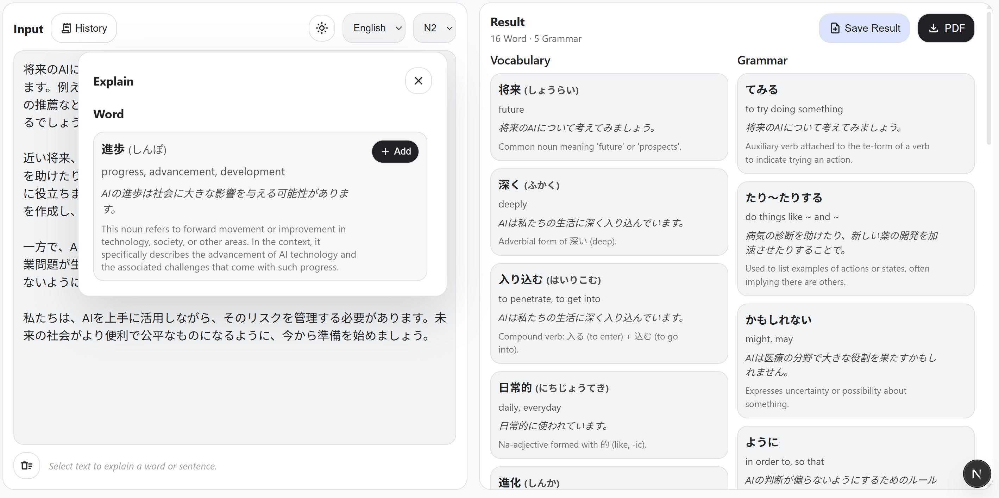
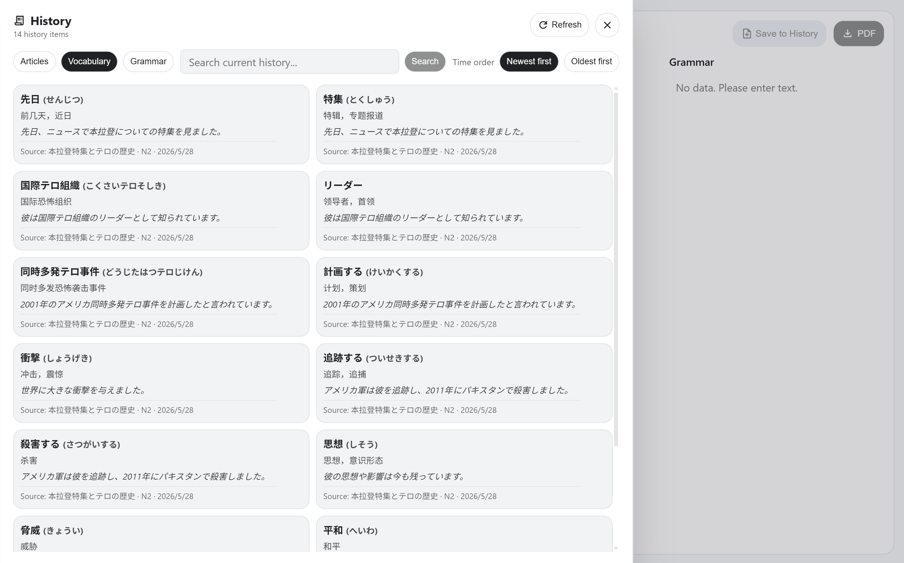

# JP Reading Assistant

面向日语阅读学习的 AI 助手，把真实文本转化为结构化学习材料。

[English](README.md) | [简体中文](README.zh.md)

JP Reading Assistant 是一个围绕真实阅读流程构建的全栈 Web 应用：输入或实时生成日语文本，提取词汇与语法，针对难点做上下文解释，整理结果列表，并将学习记录保存下来以便后续复习。

## 项目亮点

- 词汇、语法、翻译、标题生成都走结构化输出流程
- 分析、解释、翻译、文本生成、PDF 导出、持久化职责拆分清晰
- 具备实际产品 UX 考量：结果可编辑、历史记录可回载、语言切换、暗色模式、加载与错误反馈
- 后端通过统一抽象层支持多个 LLM provider

## Demo

- [Demo Video Link Here](https://your-demo-link-here)

<p align="center">
  
  <br/>
  <em>主界面</em>
</p>
<p align="center">
  
  <br/>
  <em>分析结果</em>
</p>
<p align="center">
  
  <br/>
  <em>上下文解释面板</em>
</p>
<p align="center">
  
  <br/>
  <em>历史保存</em>
</p>

## 核心功能

- 输入日语文本，并按所选 JLPT 等级提取词汇和语法点
- 按主题、等级、长度、风格生成日语阅读材料
- 对选中的内容进行上下文解释
- 对短文本和整句使用不同的 explain 流程
- 支持把解释结果加入列表，或手动删除分析项
- 将分析结果保存到本地 SQLite 数据库
- 在历史面板中浏览、刷新、加载、删除已保存结果
- 将当前结果导出为 PDF
- 在英文和中文之间切换解释/输出语言
- 支持浅色与深色模式

## 工作流程

1. 手动输入日语文本，或通过 AI 生成阅读材料。
2. 锁定当前文本并发起分析请求。
3. 后端返回结构化的词汇和语法结果。
4. 选中单词或句子，请求上下文解释。
5. 如果是句子解释，系统会分开执行翻译和分析。
6. 用户可以在前端编辑最终学习列表。
7. 将结果保存到 SQLite，或导出为 PDF。

## 技术栈

- Frontend: Next.js 16, React 19, TypeScript
- Backend: Python FastAPI, Pydantic v2, SQLModel, Uvicorn
- Database: SQLite
- LLM 集成: Ollama, OpenAI, Gemini, DeepSeek, Mock provider
- 稳定性: 基于 Tenacity 的 LLM 重试机制
- PDF 导出: ReportLab + Noto Sans JP / SC

## 技术实现重点

### 结构化 LLM 输出

- 后端服务以 JSON 结构为目标输出，并通过 Pydantic 模型校验
- `backend/app/services/llm.py` 统一负责 JSON 提取、Schema 校验和自动重试
- provider 切换通过策略映射完成，而不是把分支逻辑散落到各个业务模块

### 模块化前后端设计

- `frontend/app/page.tsx` 主要负责页面编排和状态协调
- 主要异步流程拆分为 `useAnalyzeFeature`、`useExplainFeature`、`useGenerateTextFeature`、`useExportPdf`、`useSavedResultsFeature`
- 后端按 API、service、repository、model、schema 分层组织

### 分析流程与解释流程分离

- `POST /api/analyze` 负责从整段文本中提取值得学习的词汇和语法
- `POST /api/explain` 支持两条路径：
- 单词模式返回聚焦解释
- 句子模式组合翻译和分析结果
- 这种拆分让接口职责更清晰，也更符合阅读场景下的用户预期

### 持久化、历史记录与导出

- 阅读结果通过 `Result`、`Vocab`、`Grammar` 三层表结构存入 SQLite
- 历史面板支持列表、详情回载、刷新和删除
- 保存标题由后端生成；如果标题生成失败，会回退到文本截断预览
- 当前结果可以导出为 PDF，方便离线复习

## 项目结构

```text
jp-reading-assistant/
├─ backend/
│  ├─ app/
│  │  ├─ api/            # FastAPI 路由
│  │  ├─ db/             # 数据库初始化与 session 管理
│  │  ├─ models/         # SQLModel 表模型
│  │  ├─ repositories/   # 数据访问层
│  │  ├─ services/       # LLM、分析、解释、PDF、持久化
│  │  ├─ schemas.py      # 请求 / 响应契约
│  │  └─ main.py         # FastAPI 入口
│  └─ tests/
├─ frontend/
│  ├─ app/               # Next.js App Router
│  ├─ components/        # UI 面板与弹窗
│  ├─ hooks/             # Feature hooks
│  └─ lib/               # API、i18n、辅助函数、类型定义
└─ docs/
   ├─ architecture.md
   └─ decision_log.md
```

## API 概览

- `POST /api/analyze`
- `POST /api/explain`
- `POST /api/generate-text`
- `POST /api/export_pdf`
- `POST /api/results`
- `GET /api/results`
- `GET /api/results/{result_id}`
- `DELETE /api/results/{result_id}`
- `GET /health`

## 本地运行

### Backend

```bash
cd backend
python -m venv .venv
```

Windows:

```bash
.\.venv\Scripts\Activate.ps1
```

macOS / Linux:

```bash
source .venv/bin/activate
```

安装依赖：

```bash
pip install -r ../requirements.txt
```

先将 `backend/.env.example` 复制为 `backend/.env`，再启动服务：

```bash
uvicorn app.main:app --reload
```

### Frontend

创建 `frontend/.env` 或 `frontend/.env.local`：

```env
NEXT_PUBLIC_BACKEND_URL=http://127.0.0.1:8000
```

然后运行：

```bash
cd frontend
npm install
npm run dev
```

### Windows 快速启动

项目根目录已提供启动脚本：

```powershell
.\start-dev.ps1
```

首次安装依赖：

```powershell
.\start-dev.ps1 -Install
```

## 环境配置说明

当前后端支持分别配置以下 provider：

- analyzer
- explainer
- translator
- text generator

代码中已支持的 provider 包括：

- `ollama`
- `openai`
- `gemini`
- `deepseek`
- `mock`

## 现实可行的后续改进

- 改进 provider 配置体验，并把所有支持的环境变量文档化得更完整
- 为历史记录增加搜索、筛选或标签能力

## 工程挑战与经验总结

- 把 JSON 提取、Schema 校验和重试逻辑下沉到统一的 LLM 层后，整体稳定性明显高于在各个 service 中重复处理
- 前端从“大页面组件”拆到 feature hooks 后，职责边界更清晰，后续扩展成本更低
- 把句子解释设计为“翻译 + 分析”的组合流程，比用一个超大 prompt 同时做所有事情更清晰
- 一个实际的工程挑战是分清每个接口和每一层到底应该负责什么；把标题生成、数据保存、解释与分析等职责边界明确下来之后，整个系统才更容易维护和扩展

## 补充说明

- 当前历史记录保存在本地 SQLite 中
- 项目已包含健康检查接口和基于环境变量的 CORS 配置，方便部署
- 相关设计记录见 [docs/architecture.md](docs/architecture.md) 与 [docs/decision_log.md](docs/decision_log.md)
