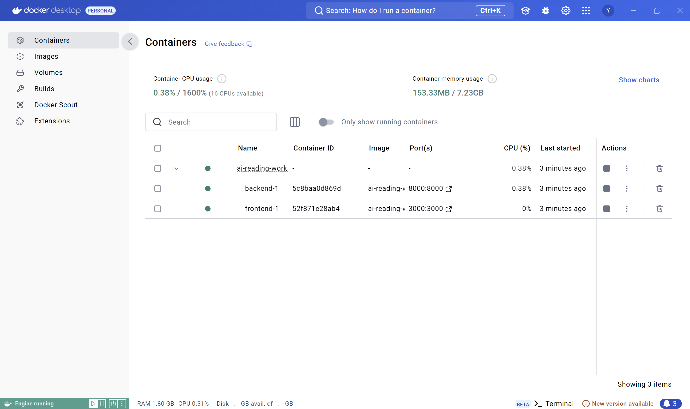

# AI-Powered Japanese Reading Workflow

[English](README.md) | [简体中文](README.zh.md)

一个全栈 AI 应用，用 LLM 驱动的分析管线把日语文本转化为结构化学习材料。

使用 FastAPI、Next.js、Docker 和多 provider LLM 集成构建。

## 技术栈

* Frontend: Next.js, React, TypeScript
* Backend: FastAPI, Pydantic, SQLModel
* AI: OpenAI, Gemini, DeepSeek, Ollama
* Infrastructure: Docker Compose, Langfuse
* Evaluation: 自定义数据集与 LLM benchmark
* Database: SQLite

## 项目亮点

* 基于 Pydantic 校验的结构化 LLM 输出管线
* 支持多个 LLM provider: OpenAI, Gemini, DeepSeek, Ollama
* 集成 Langfuse，用于 tracing 和 monitoring
* 包含 evaluation dataset 和 LLM 输出质量 benchmark
* 使用 Docker Compose 支持可复现的多服务部署

## 工程设计

* 分析、解释、翻译、文本生成、PDF 导出和持久化之间职责边界清晰
* 具备真实产品体验：结果可编辑、历史记录可回载、语言切换、深色模式、加载与错误处理
* 前后端模块化架构，关注可维护性和可扩展性

## Demo

- [Demo 视频链接](https://youtu.be/NV0gn7CtJrc)

<p align="center">
  
  <br/>
  <em>主界面和 AI 文本生成</em>
</p>
<p align="center">
  
  <br/>
  <em>分析结果</em>
</p>
<p align="center">
  
  <br/>
  <em>上下文解释面板</em>
</p>
<p align="center">
  
  <br/>
  <em>历史记录</em>
</p>
<p align="center">
  
  <br/>
  <em>使用 Docker Compose 运行</em>
</p>

## 项目结构

```text
ai-reading-workflow/
├─ .env.example         # Docker Compose 环境变量模板
├─ .dockerignore        # Docker 构建排除规则
├─ docker-compose.yml   # 本地全栈 Docker 编排
├─ backend/
│  ├─ Dockerfile        # FastAPI 生产容器
│  ├─ app/
│  │  ├─ api/            # FastAPI routes
│  │  ├─ db/             # 数据库初始化和 session 管理
│  │  ├─ models/         # SQLModel 表模型
│  │  ├─ observability/  # Langfuse client 和 LLM tracing helpers
│  │  ├─ repositories/   # 数据访问层
│  │  ├─ services/       # LLM、分析、解释、PDF、持久化
│  │  ├─ schemas.py      # 请求/响应契约
│  │  └─ main.py         # FastAPI 入口
│  └─ evals/
│    ├─ datasets/       # Analyze API evaluation datasets
│    └─ runners/        # 本地 evaluation runner
├─ frontend/
│  ├─ Dockerfile        # Next.js 生产容器
│  ├─ app/               # Next.js App Router
│  ├─ components/        # UI 面板和弹窗
│  ├─ hooks/             # Feature hooks
│  └─ lib/               # API client, i18n, helpers, types
└─ docs/
   └─ decision_log.md
```

## 核心功能

- 输入日语文本，并按所选 JLPT 等级分析词汇和语法
- 按主题、等级、长度和风格生成日语阅读材料
- 对选中文本做上下文解释
- 短文本和整句解释使用不同流程
- 通过添加解释项或删除分析项来编辑结果列表
- 将分析会话保存到本地 SQLite 数据库
- 在历史面板中回载、浏览、刷新和删除保存结果
- 将当前结果列表导出为 PDF
- 在英文和中文之间切换解释/输出语言
- 支持浅色和深色模式

## 工作流程

1. 手动输入日语文本，或通过 AI 生成阅读材料。
2. 锁定文本，并发送到分析管线。
3. 后端返回结构化的词汇和语法条目。
4. 选中单词或句子，请求上下文解释。
5. 对于句子解释，应用会把翻译和分析拆成两个步骤。
6. 在前端编辑最终学习列表。
7. 将会话保存到 SQLite，或导出为 PDF。

## 技术实现重点

### 结构化 LLM 输出

- 后端服务要求 LLM 返回 JSON 结构，并使用 Pydantic 模型校验
- LLM 响应在 `backend/app/services/llm.py` 中统一完成提取、校验和重试
- Provider 切换通过策略映射完成，避免业务模块中散落 provider 分支

### LLM Observability and Evaluation

- Langfuse 记录 provider 调用的 service、provider、model、prompt/output preview、duration、估算 token usage 和 success/failure metadata
- 轻量 analyze evaluation runner 使用自定义 N2 语法/词汇数据集，对多个模型比较 precision、recall、F1 和 latency，报告保存在 `backend\evals\reports`

### 模块化前后端设计

- 前端页面编排集中在 `frontend/app/page.tsx`
- 异步产品流程拆分为 `useAnalyzeFeature`、`useExplainFeature`、`useGenerateTextFeature`、`useExportPdf` 和 `useSavedResultsFeature`
- 后端职责按 API routes、services、repositories、models 和 schemas 分层组织

### 持久化、历史记录与导出

- 阅读会话通过 `Result`、`Vocab` 和 `Grammar` 表保存到 SQLite
- 历史面板支持列表、详情回载、刷新和删除流程
- 保存标题由后端生成；标题生成失败时会回退到文本预览标题
- 当前结果可以导出为 PDF，方便离线复习

### API 概览

- `POST /api/analyze`
- `POST /api/explain`
- `POST /api/generate-text`
- `POST /api/export_pdf`
- `POST /api/history/articles`
- `GET /api/history/articles`
- `GET /api/history/articles/search`
- `GET /api/history/articles/{article_id}`
- `DELETE /api/history/articles/{article_id}`
- `GET /api/history/vocab`
- `GET /api/history/vocab/search`
- `GET /api/history/grammar`
- `GET /api/history/grammar/search`
- `GET /health`

## 本地运行

### Docker 快速启动

第一次使用 Docker：

```bash
git clone https://github.com/yjcwang/ai-reading-workflow.git
cd ai-reading-workflow
cp .env.example .env
docker compose up --build
```

打开 `http://localhost:3000` 访问前端。后端会暴露在 `http://localhost:8000`。

第一次构建完成后，日常启动可以直接运行：

```bash
docker compose up
```

根目录 `.env` 只给 Docker Compose 使用。默认配置会将所有 LLM provider 设置为 `mock`，因此没有 API key 也可以启动应用。如果要使用真实 provider，编辑 `.env`。

SQLite 数据会保存在 Docker volume `backend_data` 中。

### Backend

如果使用 `jpread` conda 环境：

```bash
conda activate jpread
cd backend
pip install -r ../requirements.txt
uvicorn app.main:app --reload
```

如果使用本地虚拟环境：

```bash
cd backend
python -m venv .venv
```

Windows:

```bash
.\.venv\Scripts\Activate.ps1
```

macOS / Linux:

```bash
source .venv/bin/activate
```

安装依赖：

```bash
pip install -r ../requirements.txt
```

从 `backend/.env.example` 创建 `backend/.env`，然后启动服务：

```bash
uvicorn app.main:app --reload
```

### Frontend

创建 `frontend/.env` 或 `frontend/.env.local`：

```env
NEXT_PUBLIC_BACKEND_URL=http://127.0.0.1:8000
```

然后运行：

```bash
cd frontend
npm install
npm run dev
```

### Windows 快速启动

项目根目录提供了本地启动脚本：

```powershell
.\start-dev.ps1
```

首次安装依赖：

```powershell
.\start-dev.ps1 -Install
```
