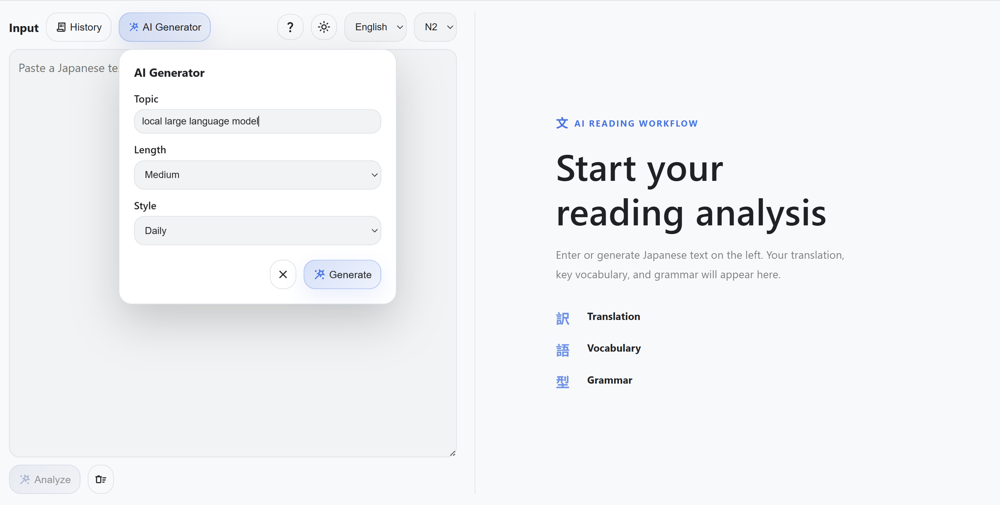
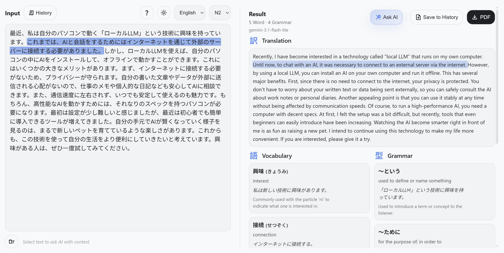
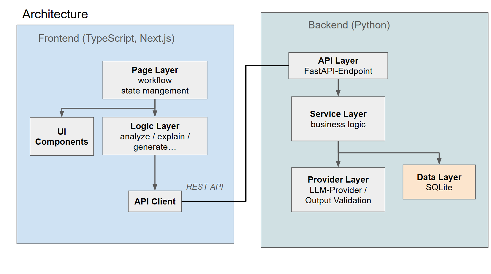

# AI-Powered Japanese Reading Workflow

一个全栈 AI 应用，用 LLM 驱动的分析管线把日语文本转化为结构化学习材料。

使用 FastAPI、Next.js、Docker 和多 provider LLM 集成构建。

## 技术栈

* Frontend: Next.js, React, TypeScript
* Backend: FastAPI, Pydantic, SQLModel
* LLM APIs: Gemini, DeepSeek, Ollama
* Infrastructure: Docker Compose, Langfuse
* Evaluation: 自定义数据集与 LLM benchmark
* Database: SQLite

## Demo

- [Demo 视频链接](https://youtu.be/NV0gn7CtJrc)

<p align="center">
  
  <br/>
  <em>主界面和 AI 文本生成</em>
</p>
<p align="center">
  
  <br/>
  <em>分析结果</em>
</p>

更多截图见 [`docs/screenshot/screenshots.md`](docs/screenshot/screenshots.md)。

## 功能

* 按所选 JLPT 等级分析日语文本，生成词汇和语法列表
* 按主题、等级、长度和风格生成日语阅读材料
* 对选中的单词或句子做上下文解释
* 编辑、保存、回载、搜索和删除阅读历史
* 将学习结果导出为 PDF
* 在英文和中文之间切换输出语言
* 支持浅色和深色模式

## 技术亮点

* 使用 FastAPI 和 Next.js 构建全栈架构，服务边界清晰
* 基于 Pydantic 校验的结构化 LLM 输出管线，并包含重试处理
* 支持 Gemini、DeepSeek 和 Ollama 等多个 LLM provider
* 使用 Langfuse 记录 provider 调用、延迟、预览、token 估算和失败信息
* 使用 SQLite 持久化阅读会话、词汇和语法历史
* 使用 Docker Compose 支持可复现的本地部署
* API 摘要：[`docs/reference/api/index.md`](docs/reference/api/index.md)

## Evaluation

结合Langfuse，项目包含一个面向 analyze 流程的轻量评测方案。

架构总览图：[`docs/reference/architecture/architecture-overview.png`](docs/reference/architecture/architecture-overview.png)

## 项目结构



仓库结构见
[`docs/reference/architecture/project-structure.md`](docs/reference/architecture/project-structure.md)。

## Quick Start

```bash
git clone https://github.com/yjcwang/ai-reading-workflow.git
cd ai-reading-workflow
cp .env.example .env
docker compose up --build
```

More setup: [`docs/reference/developement.md`](docs/reference/developement.md)

[English](README.md) | [简体中文](README.zh.md)
